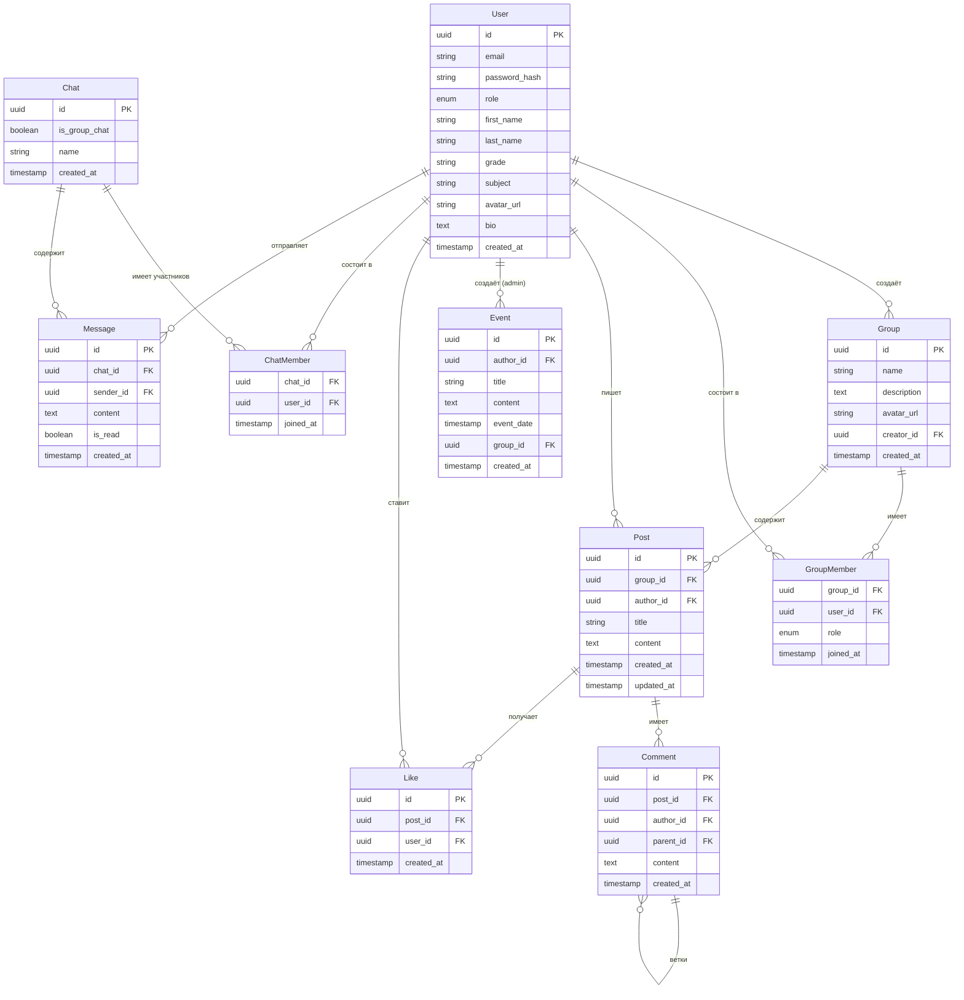

# Финальный проект 2-го полугодия
### Социальная сеть для лицеистов
**Этап 1 — Подготовка к проекту**

---

## 1. Выбор стека технологий

Проект разбит на два независимых приложения — фронтенд (SPA) и бэкенд (REST API).

### Фронтенд

| Технология | Назначение |
|---|---|
| React + TypeScript | UI-фреймворк с типизацией |
| Vite | Сборщик, быстрый dev-сервер |
| React Router v6 | Клиентская маршрутизация |
| TanStack Query | Кэширование и синхронизация серверных данных |
| Zustand | Глобальное состояние (auth, UI) |
| Vitest + Testing Library | Unit- и интеграционные тесты |
| Playwright | End-to-end тесты |
| ESLint + Prettier | Линтер и форматировщик |

### Бэкенд

| Технология | Назначение |
|---|---|
| Python + FastAPI | REST API, автогенерация документации |
| PostgreSQL | Основная СУБД |
| SQLAlchemy + Alembic | ORM и миграции (требование задания) |
| Redis | Кэширование тяжёлых запросов (+1 балл) |
| Docker + docker-compose | Контейнеризация (требование задания) |
| JWT (python-jose) | Аутентификация |
| Pytest + httpx | Unit- и интеграционные тесты |
| Ruff | Линтер и форматировщик для Python |

---

## 2. Пользовательские сценарии

В системе 4 роли: **Гость**, **Ученик**, **Учитель** (оба считаются «авторизованными пользователями») и **Администратор**. Учитель обладает всеми правами ученика, а также может создавать группы. Администратор — суперпользователь.

| Актор | Сценарий | Описание |
|---|---|---|
| Гость | Просмотр публичного контента | Открывает сайт, видит публичную ленту событий. Не может оставить комментарий или вступить в группу. |
| Гость | Регистрация | Заполняет форму (имя, email, пароль, роль). Получает подтверждение и попадает в ленту. |
| Ученик / Учитель | Вход в систему | Вводит email и пароль, получает JWT-токены, перенаправляется в ленту. |
| Ученик / Учитель | Просмотр ленты | Видит последние публикации из своих групп и ближайшие мероприятия. Может загружать следующую страницу (пагинация). |
| Ученик / Учитель | Поиск и вступление в группу | Вводит название в поиск, открывает страницу группы, нажимает «Вступить». |
| Ученик / Учитель | Публикация поста | В странице группы (если модератор/создатель) создаёт пост с заголовком и текстом. |
| Ученик / Учитель | Комментарий и лайк | Читает пост, ставит лайк, оставляет комментарий. Удалить свой комментарий может только автор. |
| Ученик / Учитель | Личное сообщение | Находит пользователя через поиск, открывает чат, пишет сообщение. |
| Ученик / Учитель | Редактирование профиля | Открывает свой профиль, меняет аватар, биографию, ссылки на соц. сети. |
| Учитель | Создание группы | Заполняет форму (название, описание, аватар), становится владельцем группы. |
| Учитель | Управление участниками | Назначает модераторов, исключает участников. |
| Администратор | Создание новости / мероприятия | Заполняет форму: заголовок, текст, дата (только для мероприятий). Публикация видна всем в ленте. |
| Администратор | Модерация контента | Может удалить любую публикацию, комментарий или пользователя. |

---

## 3. Структура базы данных (ER-диаграмма)

Связи: User 1→N Post, Group 1→N Post, User M↔N Group (через GroupMember), Post 1→N Comment, Post 1→N Like, Chat M↔N User (через ChatMember), Chat 1→N Message.

### 3.1 User — пользователь

| Поле | Тип | Описание |
|---|---|---|
| id | UUID (PK) | Первичный ключ |
| email | VARCHAR(255) | Уникальный, не NULL |
| password_hash | VARCHAR(255) | Хэш пароля (bcrypt) |
| role | ENUM | student \| teacher \| admin |
| first_name | VARCHAR(100) | Имя |
| last_name | VARCHAR(100) | Фамилия |
| grade | VARCHAR(10) | Класс (для учеников, напр. «10А») |
| subject | VARCHAR(100) | Предмет (для учителей) |
| avatar_url | VARCHAR(500) | Ссылка на аватар, nullable |
| bio | TEXT | Биография, nullable |
| created_at | TIMESTAMP | Дата регистрации |

### 3.2 Group — сообщество

| Поле | Тип | Описание |
|---|---|---|
| id | UUID (PK) | Первичный ключ |
| name | VARCHAR(200) | Название группы |
| description | TEXT | Описание, nullable |
| avatar_url | VARCHAR(500) | Аватар группы, nullable |
| creator_id | UUID (FK→User) | Создатель группы |
| created_at | TIMESTAMP | Дата создания |

### 3.3 GroupMember — участники группы

| Поле | Тип | Описание |
|---|---|---|
| group_id | UUID (FK→Group) | Составной PK |
| user_id | UUID (FK→User) | Составной PK |
| role | ENUM | member \| moderator \| owner |
| joined_at | TIMESTAMP | Дата вступления |

### 3.4 Post — публикация

| Поле | Тип | Описание |
|---|---|---|
| id | UUID (PK) | Первичный ключ |
| group_id | UUID (FK→Group) | Группа, к которой относится пост |
| author_id | UUID (FK→User) | Автор публикации |
| title | VARCHAR(300) | Заголовок |
| content | TEXT | Текст публикации |
| created_at | TIMESTAMP | Дата создания |
| updated_at | TIMESTAMP | Дата последнего изменения |

### 3.5 Event — новость / мероприятие

| Поле | Тип | Описание |
|---|---|---|
| id | UUID (PK) | Первичный ключ |
| author_id | UUID (FK→User) | Только администратор |
| title | VARCHAR(300) | Заголовок |
| content | TEXT | Текст |
| event_date | TIMESTAMP | Дата мероприятия (NULL = новость) |
| group_id | UUID (FK→Group) | Привязка к группе, nullable |
| created_at | TIMESTAMP | Дата создания |

### 3.6 Comment — комментарий

| Поле | Тип | Описание |
|---|---|---|
| id | UUID (PK) | Первичный ключ |
| post_id | UUID (FK→Post) | Публикация |
| author_id | UUID (FK→User) | Автор |
| parent_id | UUID (FK→Comment) | Родительский комментарий (для веток), nullable |
| content | TEXT | Текст комментария |
| created_at | TIMESTAMP | Дата создания |

### 3.7 Like — оценка публикации

| Поле | Тип | Описание |
|---|---|---|
| id | UUID (PK) | Первичный ключ |
| post_id | UUID (FK→Post) | Публикация |
| user_id | UUID (FK→User) | Пользователь |
| created_at | TIMESTAMP | Дата лайка |
| | UNIQUE(post_id, user_id) | Один лайк от пользователя |

### 3.8 Chat — чат

| Поле | Тип | Описание |
|---|---|---|
| id | UUID (PK) | Первичный ключ |
| is_group_chat | BOOLEAN | false = личка, true = групповой чат |
| name | VARCHAR(200) | Название (только для групповых), nullable |
| created_at | TIMESTAMP | Дата создания |

### 3.9 ChatMember — участники чата

| Поле | Тип | Описание |
|---|---|---|
| chat_id | UUID (FK→Chat) | Составной PK |
| user_id | UUID (FK→User) | Составной PK |
| joined_at | TIMESTAMP | Дата добавления |

### 3.10 Message — сообщение

| Поле | Тип | Описание |
|---|---|---|
| id | UUID (PK) | Первичный ключ |
| chat_id | UUID (FK→Chat) | Чат |
| sender_id | UUID (FK→User) | Отправитель |
| content | TEXT | Текст сообщения |
| is_read | BOOLEAN | Прочитано ли |
| created_at | TIMESTAMP | Время отправки |

---

## 4. Конечные точки API (контракты)

Базовый URL: `/api/v1`

Все запросы (кроме `/auth`) требуют заголовка `Authorization: Bearer <token>`. Ответы всегда в формате JSON. Пагинация: `?page=1&limit=20`. Ошибки: `{ "detail": "...", "code": "..." }`.

### 4.1 Аутентификация

| Метод | Путь | Описание / Доступ |
|---|---|---|
| `POST` | `/auth/register` | Регистрация. Body: email, password, role, first_name, last_name |
| `POST` | `/auth/login` | Вход. Body: email, password. Response: access_token, refresh_token |
| `POST` | `/auth/logout` | Выход (инвалидация refresh-токена) |
| `POST` | `/auth/refresh` | Обновление токенов. Body: refresh_token |

### 4.2 Пользователи

| Метод | Путь | Описание / Доступ |
|---|---|---|
| `GET` | `/users` | Список пользователей. Query: search, grade, subject, page, limit |
| `GET` | `/users/me` | Профиль текущего пользователя |
| `GET` | `/users/{id}` | Профиль пользователя по ID |
| `PATCH` | `/users/{id}` | Редактирование профиля (только свой или admin) |
| `DELETE` | `/users/{id}` | Удаление пользователя (только admin) |

### 4.3 Группы (сообщества)

| Метод | Путь | Описание / Доступ |
|---|---|---|
| `GET` | `/groups` | Список групп. Query: search, page, limit |
| `POST` | `/groups` | Создание группы (teacher / admin) |
| `GET` | `/groups/{id}` | Информация о группе + список участников |
| `PATCH` | `/groups/{id}` | Редактирование (owner / moderator / admin) |
| `DELETE` | `/groups/{id}` | Удаление (owner / admin) |
| `GET` | `/groups/{id}/members` | Участники группы. Query: page, limit |
| `POST` | `/groups/{id}/members` | Вступить в группу (текущий пользователь) |
| `DELETE` | `/groups/{id}/members/{userId}` | Выйти из группы или исключить (owner / admin) |
| `PATCH` | `/groups/{id}/members/{userId}` | Изменить роль участника (owner) |

### 4.4 Публикации

| Метод | Путь | Описание / Доступ |
|---|---|---|
| `GET` | `/groups/{id}/posts` | Публикации группы. Query: page, limit |
| `POST` | `/groups/{id}/posts` | Создать публикацию (moderator / owner / admin) |
| `GET` | `/posts/{id}` | Публикация по ID |
| `PATCH` | `/posts/{id}` | Редактировать (author / moderator / admin) |
| `DELETE` | `/posts/{id}` | Удалить (author / moderator / admin) |
| `POST` | `/posts/{id}/likes` | Поставить лайк |
| `DELETE` | `/posts/{id}/likes` | Убрать лайк |

### 4.5 Комментарии

| Метод | Путь | Описание / Доступ |
|---|---|---|
| `GET` | `/posts/{id}/comments` | Комментарии к посту. Query: page, limit |
| `POST` | `/posts/{id}/comments` | Добавить комментарий. Body: content, parent_id (nullable) |
| `PATCH` | `/comments/{id}` | Редактировать (только автор) |
| `DELETE` | `/comments/{id}` | Удалить (author / admin) |

### 4.6 Лента / Мероприятия

| Метод | Путь | Описание / Доступ |
|---|---|---|
| `GET` | `/feed` | Объединённая лента (посты из своих групп + ближайшие события). Query: page, limit |
| `GET` | `/events` | Все события. Query: from, to, page, limit |
| `POST` | `/events` | Создать новость или мероприятие (только admin). Body: title, content, event_date (nullable) |
| `GET` | `/events/{id}` | Событие по ID |
| `PATCH` | `/events/{id}` | Редактировать (только admin) |
| `DELETE` | `/events/{id}` | Удалить (только admin) |

### 4.7 Сообщения и чаты

| Метод | Путь | Описание / Доступ |
|---|---|---|
| `GET` | `/chats` | Список чатов текущего пользователя |
| `POST` | `/chats` | Создать чат. Body: user_ids[], name (для групповых) |
| `GET` | `/chats/{id}/messages` | Сообщения чата. Query: page, limit |
| `POST` | `/chats/{id}/messages` | Отправить сообщение. Body: content |
| `PATCH` | `/chats/{id}/messages/{msgId}` | Пометить прочитанным |

---